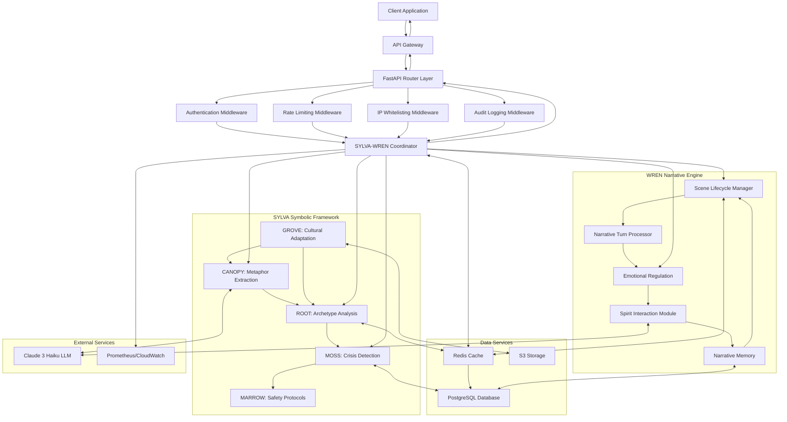
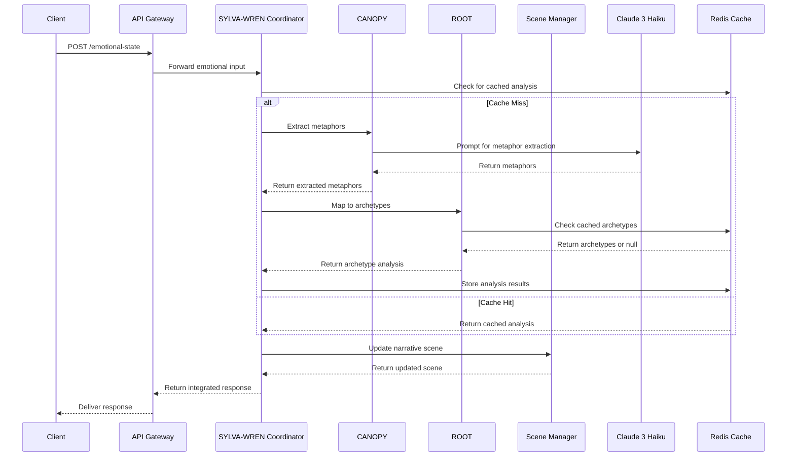
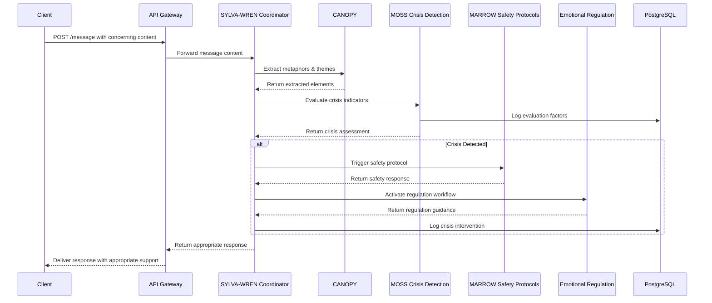
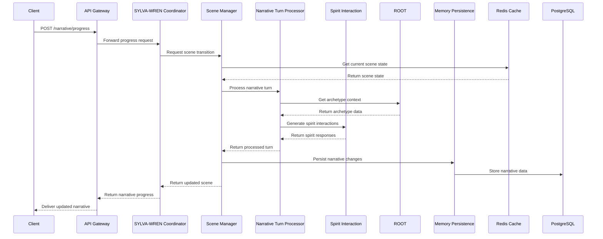

# SYLVA & WREN Integration Architecture

## System Integration Diagram



## Data Flow Specifications

### 1. Emotional Input Processing Flow



### 2. Crisis Detection Flow



### 3. Narrative Scene Transition Flow



## Key System Interfaces

### 1. SYLVA-WREN Coordinator Interface

```python
class SylvaWrenCoordinator:
    """
    Core integration layer between SYLVA symbolic processing and WREN narrative engine.
    Manages state fusion, symbolic routing, and ensures unified response generation.
    """
    
    async def process_emotional_input(self, input_data: EmotionalInput) -> IntegratedResponse:
        """Process emotional input through both symbolic and narrative systems"""
        
    async def evaluate_crisis_indicators(self, message_content: str, user_context: UserContext) -> CrisisAssessment:
        """Evaluate potential crisis indicators in message content with user context"""
        
    async def progress_narrative(self, user_id: str, scene_id: str, actions: List[UserAction]) -> NarrativeScene:
        """Progress narrative scene based on user actions"""
        
    async def generate_symbolic_response(self, emotional_state: EmotionalState) -> SymbolicResponse:
        """Generate symbolically-informed response based on emotional state"""
        
    async def synchronize_states(self, symbolic_state: SymbolicState, narrative_state: NarrativeState) -> IntegratedState:
        """Synchronize symbolic and narrative states for consistent user experience"""
```

### 2. CANOPY Metaphor Extraction Interface

```python
class CANOPYMetaphorExtractor:
    """
    Extracts metaphors, themes, and symbolic elements from user input.
    """
    
    async def extract_metaphors(self, text: str, user_context: Dict) -> List[Metaphor]:
        """Extract metaphors from text with user context"""
        
    async def classify_themes(self, metaphors: List[Metaphor]) -> List[Theme]:
        """Classify metaphors into thematic groupings"""
        
    async def extract_color_symbolism(self, text: str) -> List[ColorSymbol]:
        """Extract color symbolism from text"""
        
    async def extract_nature_elements(self, text: str) -> List[NatureElement]:
        """Extract nature elements symbolism from text"""
```

### 3. ROOT Archetype Analysis Interface

```python
class ROOTArchetypeAnalyzer:
    """
    Analyzes emotional states and transforms them into archetypal patterns.
    """
    
    async def map_emotions_to_archetypes(self, emotional_state: EmotionalState) -> List[ArchetypeMapping]:
        """Map emotional state to archetypal patterns"""
        
    async def analyze_archetype_transitions(self, timeline: List[ArchetypeMapping]) -> ArchetypeTransitionAnalysis:
        """Analyze transitions between dominant archetypes over time"""
        
    async def get_dominant_archetypes(self, mapping: List[ArchetypeMapping], limit: int = 3) -> List[DominantArchetype]:
        """Get dominant archetypes from mapping with limit"""
        
    async def cached_analyze_with_context(self, emotional_state: EmotionalState, context: UserContext) -> ArchetypeAnalysis:
        """Perform cached, context-aware analysis of emotional state"""
```

### 4. Scene Lifecycle Manager Interface

```python
class SceneLifecycleManager:
    """
    Manages narrative scene creation, transitions, and lifecycle events.
    """
    
    async def create_scene(self, scene_type: SceneType, context: Dict) -> NarrativeScene:
        """Create a new narrative scene with context"""
        
    async def transition_to_next_scene(self, current_scene: NarrativeScene, transition_trigger: TransitionTrigger) -> NarrativeScene:
        """Transition to next scene based on current scene and trigger"""
        
    async def get_available_actions(self, scene: NarrativeScene, user_context: UserContext) -> List[AvailableAction]:
        """Get available actions for the current scene"""
        
    async def resolve_scene_outcome(self, scene: NarrativeScene, actions: List[UserAction]) -> SceneOutcome:
        """Resolve scene outcome based on user actions"""
```

### 5. Emotional Regulation Interface

```python
class EmotionalRegulator:
    """
    Manages emotional regulation workflows and interventions.
    """
    
    async def suggest_regulation_technique(self, emotional_state: EmotionalState, user_preferences: Dict) -> RegulationTechnique:
        """Suggest appropriate regulation technique based on emotional state"""
        
    async def track_regulation_effectiveness(self, technique: RegulationTechnique, before: EmotionalState, after: EmotionalState) -> EffectivenessReport:
        """Track effectiveness of applied regulation technique"""
        
    async def generate_grounding_exercise(self, intensity_level: int, focus_area: str) -> GroundingExercise:
        """Generate grounding exercise based on intensity level and focus area"""
        
    async def create_regulation_narrative(self, emotional_state: EmotionalState, preferred_modality: str) -> RegulationNarrative:
        """Create narrative designed to support emotional regulation"""
```
